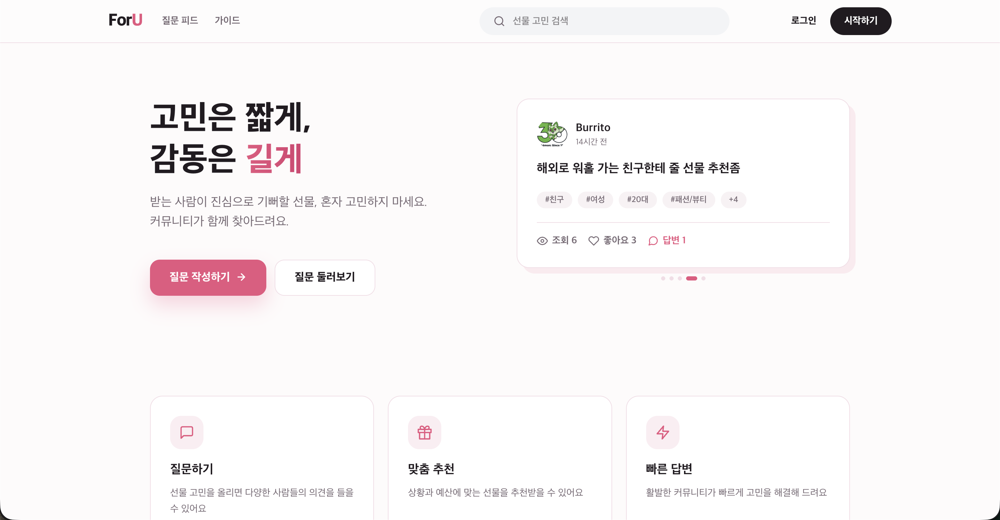
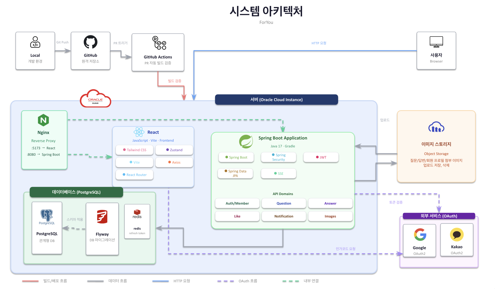
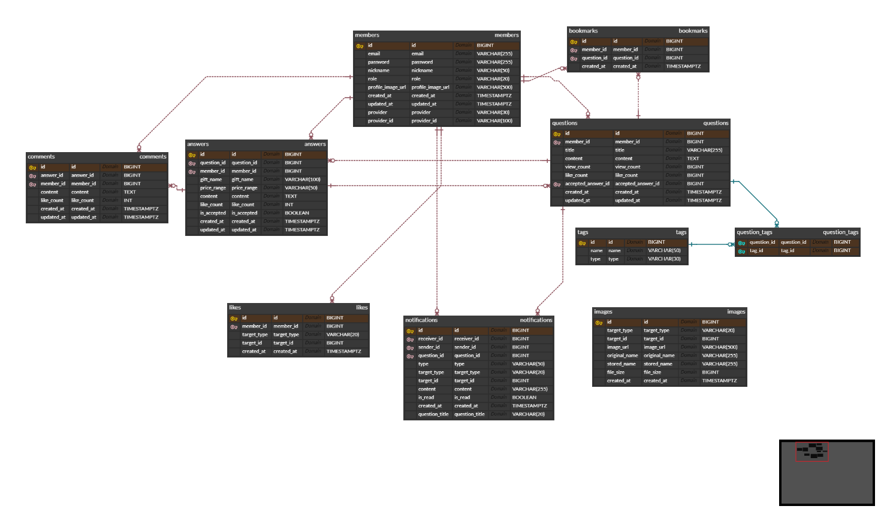

<div align="center">
  

# ForYou

> 상황과 조건에 맞는 선물을 질문하고 추천받는 Q&A 기반 선물 추천 서비스

</div>



## 프로젝트 소개

`Foryou`는 선물 고민을 질문으로 올리면 커뮤니티가 답변으로 선물을 추천해주고, 질문
작성자가 가장 마음에 드는 답변을 채택하는 Q&A 서비스입니다.

"무엇을 선물할지"
혼자 검색하고 고민하며 시간을 쓰는 대신, 받는 사람의 상황·예산·취향을 태그와
함께 질문으로 남기면 실제 경험을 가진 사람들이 답변으로 빠르게 도와주는
것을 목표로 합니다. 선물을 고르기까지의 의사결정 시간과 고민을 줄이는 데
초점을 둔 서비스입니다.

## 주요 기능

**질문 & 답변**

- 질문 작성/수정/삭제
- 태그(대상/성별/나이대/예산/상황/카테고리) 기반 조건 입력 및 검색·필터링
- 답변 작성/수정/삭제, 질문 작성자의 답변 채택
- 답변에 대한 댓글 작성/수정/삭제

**상호작용**

- 질문/답변/댓글 좋아요
- 질문 북마크
- 질문/답변 이미지 첨부

**인증 & 계정**

- 이메일/비밀번호 회원가입·로그인
- Google/Kakao 소셜 로그인
- 마이페이지(내가 쓴 질문/답변/댓글, 북마크 모아보기)
- 계정 정보 관리(닉네임, 프로필 이미지), 회원 탈퇴

**알림**

- 답변 등록/채택, 댓글, 좋아요에 대한 실시간 인앱 알림 (SSE 기반, 멀티탭 지원)

**기타**

- 이용 가이드 페이지

## 개발 기간 및 팀원

- 기간: 2026.06.24 ~ 2026.07.07 (약 2주)
- 인원: 5명 (Backend / Frontend 구분 없이 도메인 단위로 분담)

| 이름   | GitHub                                           |
| ------ | ------------------------------------------------ |
| 신민기 | [@ABCganada](https://github.com/ABCganada)       |
| 김수연 | [@julk0206](https://github.com/julk0206)         |
| 강현민 | [@gusals1213](https://github.com/gusals1213)     |
| 정재영 | [@Jungjaeyeong](https://github.com/Jungjaeyeong) |
| 이승훈 | [@awelf](https://github.com/awelf)               |

## 기술 스택

| 영역        | 기술                                                            |
| ----------- | --------------------------------------------------------------- |
| Backend     | Java 17, Spring Boot, Spring Data JPA, Spring Security, Gradle  |
| Frontend    | React, Vite, React Router, Axios, Zustand, Tailwind CSS, Oxlint |
| Database    | PostgreSQL 15 (Flyway 마이그레이션), 테스트용 H2                |
| 캐시        | Redis (refresh token 저장)                                      |
| 인증        | JWT(access/refresh), OAuth2(Google, Kakao)                      |
| 실시간 통신 | Server-Sent Events (SSE)                                        |
| 이미지 저장 | Cloudinary                                                      |
| 인프라/배포 | Docker Compose, GitHub Actions, GHCR, Oracle Cloud, nginx       |
| 문서화      | Swagger                                                         |
| 협업 도구   | Slack, GitHub                                                   |

## 시스템 아키텍처



- 로컬에서는 Vite 개발 서버가 `/api` 요청을 백엔드(`localhost:8080`)로
  프록시하고, 배포 환경에서는 프론트엔드 컨테이너의 nginx가 동일한 역할을
  합니다.
- 백엔드는 도메인별 패키지(질문/답변/댓글/회원/알림 등)로 나뉜 모듈형
  모놀리스 구조이며, 도메인 간 부수 효과(알림 생성 등)는 Spring 이벤트로
  느슨하게 연결합니다.
- 배포 환경은 Oracle Cloud 인스턴스 위에서 Docker Compose로 컨테이너
  5개(nginx · frontend · backend · postgres · redis)를 운영합니다. nginx가
  SSL 종단과 80/443 포트를 담당하고, frontend 컨테이너가 정적 파일 서빙과
  `/api` 프록시를, backend 컨테이너가 API 서버 역할을, redis가 refresh
  token 저장을 담당합니다.
- CI(GitHub Actions)는 `dev`/`main` PR에서 백엔드 빌드+테스트, 프론트
  lint+build를 검증하고, CD는 `dev` push 시 이미지를 빌드해 GHCR에 push한
  뒤 서버에 SSH로 접속해 컨테이너를 재배포합니다.

## ERD



`Like` · `Image` · `Notification`은 좋아요/이미지/알림의 대상(질문·답변·댓글
등)을 가리킬 때 `targetType + targetId` 조합의 polymorphic 참조를 사용합니다.
대상이 테이블마다 달라질 수 있어 이 부분만 DB 레벨 FK 없이 애플리케이션에서
참조 무결성을 검증하고, 그 외 관계(작성자, 질문-답변-댓글 등)는 모두 FK로
연결되어 있습니다.

`notifications`에는 `question_id` 외에 `question_title`을 함께 저장하는
비정규화 컬럼이 있는데, 알림 목록 조회 시마다 질문 테이블까지 조인하지
않고 바로 제목을 보여주기 위함입니다.

## 담당 역할

| 팀원   | 담당 영역                                        |
| ------ | ------------------------------------------------ |
| 신민기 | 공통 설정, 인증/회원, 마이페이지, 배포 환경 구성 |
| 김수연 | 알림(notification, SSE), 좋아요(like)            |
| 강현민 | 질문(question), 태그(tag), 검색                  |
| 정재영 | 질문 화면, 이미지(image), 북마크                 |
| 이승훈 | 답변(answer), 댓글(comment), 채택                |

## 주요 구현 내용

- **인증**: 이메일/비밀번호 로그인과 Google·Kakao 소셜 로그인을 지원합니다.
  access/refresh 토큰 발급과 axios 자동 재발급 큐잉까지 포함한 상세 내용은
  [docs/implementation/auth.md](docs/implementation/auth.md)를 참고하세요.

- **질문/답변/댓글 & 답변 채택**: 질문-답변-댓글 CRUD와 질문 작성자만 답변을 채택할 수
  있는 로직(`PATCH /api/answers/{answerId}/accept`)을 구현했습니다. 질문의 답변 개수는
  별도 카운트 컬럼 대신 Hibernate `@Formula` 서브쿼리(`SELECT COUNT(a.id) FROM answers ...`)로
  계산해 항상 최신 값을 반영합니다.

- **좋아요/북마크**: `likes`는 `(member, targetType, targetId)`, `bookmarks`는
  `(member, question)` unique 제약으로 중복 좋아요·북마크를 DB 레벨에서 막고, 토글
  방식(추가/취소)으로 동작합니다.

- **실시간 알림**: 답변 등록/채택, 댓글, 좋아요 발생 시 도메인 이벤트로
  알림을 생성하고 SSE로 즉시 push합니다. 상세 내용은
  [docs/implementation/notification.md](docs/implementation/notification.md)를
  참고하세요.
- **태그 기반 필터링**: 대상/성별/연령대/예산/상황/카테고리 태그를 질문과
  N:M으로 연결해 다차원 조건 검색을 지원합니다.

- **이미지 업로드**: Cloudinary와 연동해 질문/답변 첨부 이미지와 프로필
  이미지를 업로드·교체합니다. 상세 내용은
  [docs/implementation/image-upload.md](docs/implementation/image-upload.md)를
  참고하세요.
- **배포 파이프라인**: Docker Compose 기반으로 CI(빌드/테스트/린트)와 CD(GHCR
  push → 서버 배포)를 구축했습니다. 상세 내용은
  [docs/implementation/deployment.md](docs/implementation/deployment.md)를
  참고하세요.

## 기술적 고민 및 트러블슈팅

- **Self Invocation**: 좋아요 등록처럼 대상(질문/
  답변/댓글)에 따라 여러 서비스의 로직을 조합해야 하는 경우, 같은 클래스
  내부에서 `@Transactional` 메서드를 호출하면 Spring AOP 프록시를 거치지
  않아 트랜잭션이 적용되지 않는 self-invocation 문제가 생길 수 있습니다.
  `LikeService`·`QuestionService`·`AnswerService`·`CommentService` 등을
  조합하는 로직을 `LikeFacade`처럼 별도 계층으로 분리해, 항상 스프링이
  관리하는 프록시를 통해 호출되도록 구조화했습니다(Answer, Comment, Member,
  Image 도메인에도 동일한 Facade 패턴을 적용).

- **N+1 문제**: 질문 상세 응답에는 작성자(member) 정보가 함께 필요해,
  `JOIN FETCH`로 질문과 member를 한 번에 조회하도록 했습니다. 반면 질문
  목록은 페이징 조회라 태그(N:M 지연 로딩) 컬렉션을 `JOIN FETCH`로 바로
  가져올 수 없는데(페이징 + 컬렉션 fetch join을 같이 쓰면 하이버네이트가
  전체 결과를 메모리에 올려 페이징하게 됨), 대신 `Question.tags`에
  `@BatchSize(size = 100)`을 적용해 지연 로딩된 태그를 `IN` 절로 묶어
  한 번에 조회하도록 해결했습니다.

- **로그아웃이 의미 없던 인증 구조**: 초기에는 access
  token만 발급하는 구조라, JWT 특성상 서버가 발급된 토큰을 임의로
  무효화할 수 없어 로그아웃 엔드포인트가 사실상 할 수 있는 일이 없었습니다.
  이를 계기로 refresh token을 도입해 Redis에 회원별로 저장(`@RedisHash` +
  TTL)하고, 재발급 시 저장값과 대조 검증하도록 했습니다. 그 결과 로그아웃
  시 Redis에서 저장된 refresh token을 삭제하는 방식으로 이후 재발급 요청을
  막을 수 있게 되었습니다.
- **SSE Idle Timeout**: 프록시/브라우저의 idle 타임아웃으로 SSE 연결이
  자꾸 끊기는 문제(`ERR_INCOMPLETE_CHUNKED_ENCODING`)가 있었습니다.
  20초 주기로 하트비트 이벤트를 전송해 연결을 유지하고, 전송에
  실패하면 해당 emitter를 정리하도록 스케줄러를 추가해 해결했습니다.

## 로컬 실행 방법

### 사전 준비

- JDK 17 이상
- Docker Desktop
- [nvm](https://github.com/nvm-sh/nvm) 또는 Node.js `22.12.0` 이상, `23.0.0` 미만

Gradle과 프론트엔드 패키지 버전은 각각 Gradle Wrapper와
`package-lock.json`으로 관리합니다.

### 1. Backend

```bash
cd backend
docker compose -f docker-compose.local.yml up -d
./gradlew bootRun --args='--spring.profiles.active=local'
```

- 기본 주소: `http://localhost:8080`
- 테스트: `./gradlew test`
- 전체 빌드: `./gradlew build`

Windows에서는 `./gradlew` 대신 `gradlew.bat`을 사용합니다.

소셜 로그인(`oauth2`), JWT 서명(`jwt`), 이미지 업로드(`image`) 기능까지
로컬에서 온전히 테스트하려면 해당 프로필의 `application-{profile}.yaml`이
추가로 필요합니다. 비밀값이 포함되어 있어 저장소에는 포함되어 있지 않으며,
팀 내부적으로 별도 공유합니다.

```bash
./gradlew bootRun --args='--spring.profiles.active=local,jwt,oauth2,image'
```

### 2. Frontend

저장소 루트에서 Node.js 버전을 맞춘 뒤 실행합니다.

```bash
nvm install
nvm use
cd frontend
npm ci
npm run dev
```

- 개발 서버: `http://localhost:5173`
- 린트: `npm run lint`
- 프로덕션 빌드: `npm run build`

개발 서버에서 `/api`로 시작하는 요청은 `http://localhost:8080`의
백엔드로 프록시됩니다. 프론트엔드에서는 로컬 백엔드 주소를 직접 작성하지
말고 `/api/...` 형태로 요청합니다.

### 환경변수

- 프론트엔드 환경변수는 `VITE_` 접두사를 사용합니다.
- 개인 로컬 설정은 `frontend/.env.local`에 작성합니다.
- 비밀번호, API 키와 같은 비밀값은 Git에 커밋하지 않습니다.
- 백엔드 설정은 Spring Boot의 환경변수 매핑 또는 프로필별
  `application-{profile}.yaml`을 사용합니다.

## 팀 규칙

- **브랜치 전략**: `main - dev - feat/*` 구조로 관리합니다. 기능은 `dev`에서
  분기해 `feat/*`로 개발하고, `feat/* → dev`(개발 서버 배포/테스트) →
  `dev → main`(운영 서버 배포) 순으로 merge합니다.

- **커밋 메시지**: `<type>: WBS<작업번호 4자리> <작업 항목> <진행 상태>`
  형식을 사용합니다(`feat`, `fix`, `refactor`, `docs`, `chore`, `style`, `test`).
- **PR/코드 리뷰**: PR에는 작업 내용·변경 사항·테스트 내용·참고 사항을
  작성하고, CI 검사(빌드/테스트) 통과 후 merge합니다.

전체 브랜치 구조, PR 템플릿, 코드 리뷰/merge 기준, 충돌
방지 규칙 등 상세 내용은
[docs/conventions/branch-strategy.md](docs/conventions/branch-strategy.md)를
참고하세요.

## 향후 개선 사항

- 배포 환경의 무중단 배포 및 모니터링/알림 체계 보강.
- 태그 매칭을 넘어선 개인화 추천(과거 채택 이력 기반 등) 검토.
- 카디널리티가 높은 조회 조건에 대한 쿼리 인덱싱 추가.
- 관리자 페이지 기능 추가 — 회원 관리(목록/검색, 정지·탈퇴 처리, role
  변경), 태그 관리(추가/수정/삭제), 통계 대시보드(가입자·질문·답변 추이 등).
- LLM API를 활용한 답변 추천 — 질문 내용과 태그를 기반으로 선물 답변을
  자동 제안해주는 기능 검토.
